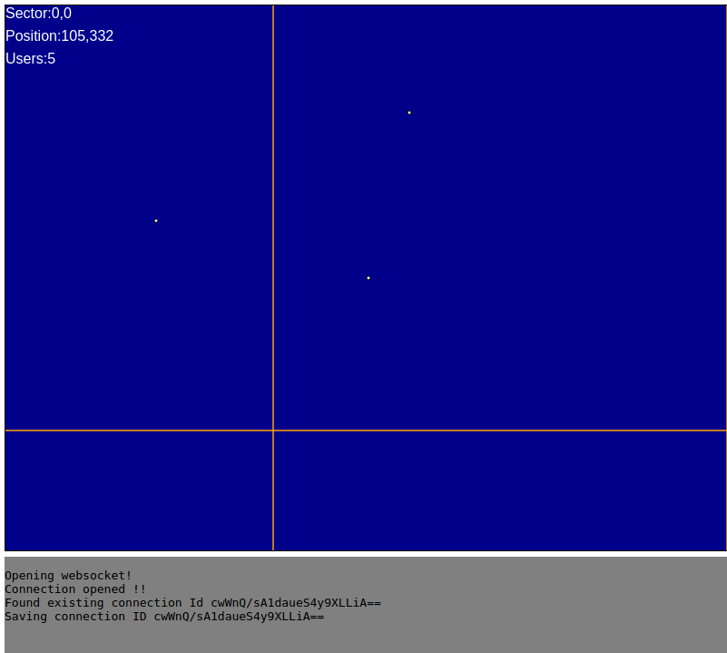

## Description

Proceduraly generated infinite multiplager scalable game with websockets



## Run with docker

```
docker-compose up 
```

go to localhost:8000

## Run

```
npm install
node server.js
```

Run `client.hmtl` on your browser to start sending requests to `localhost:8001`.

See `websocket.js` for client details.

